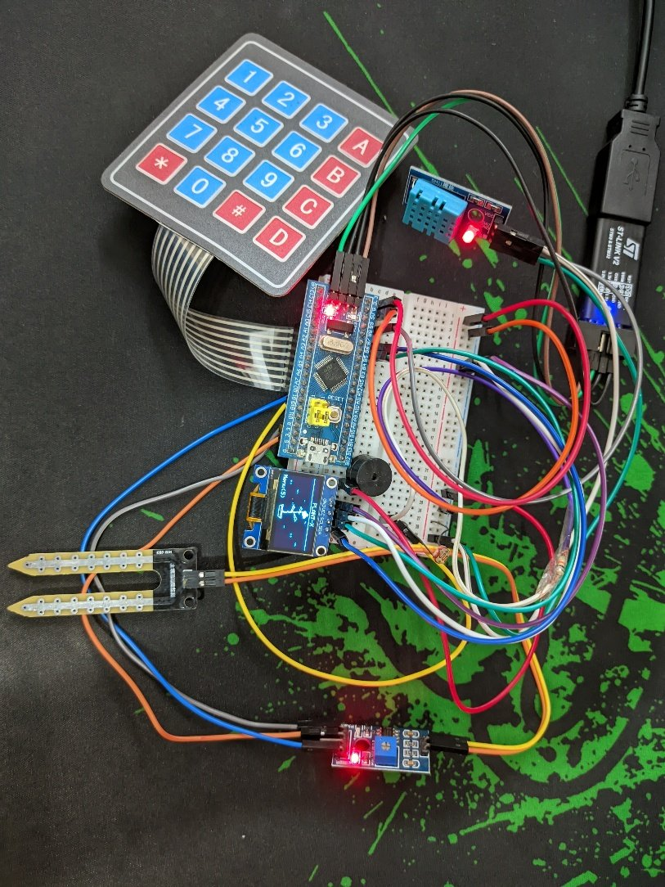
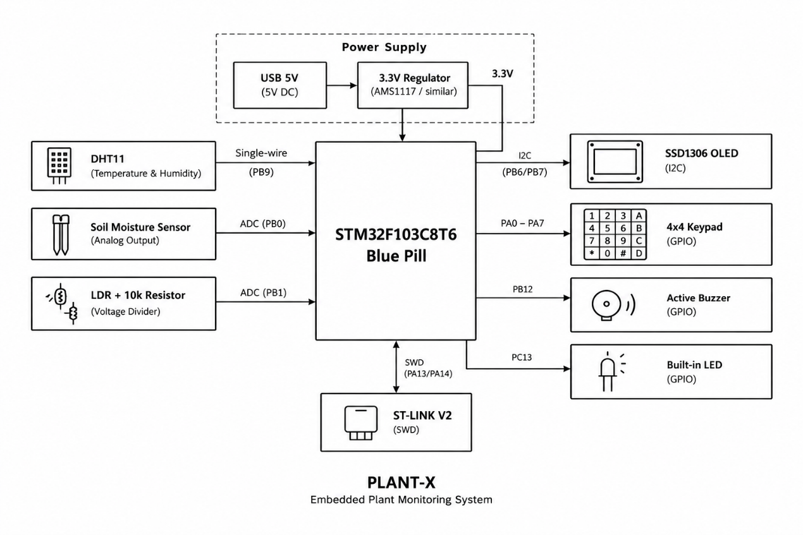
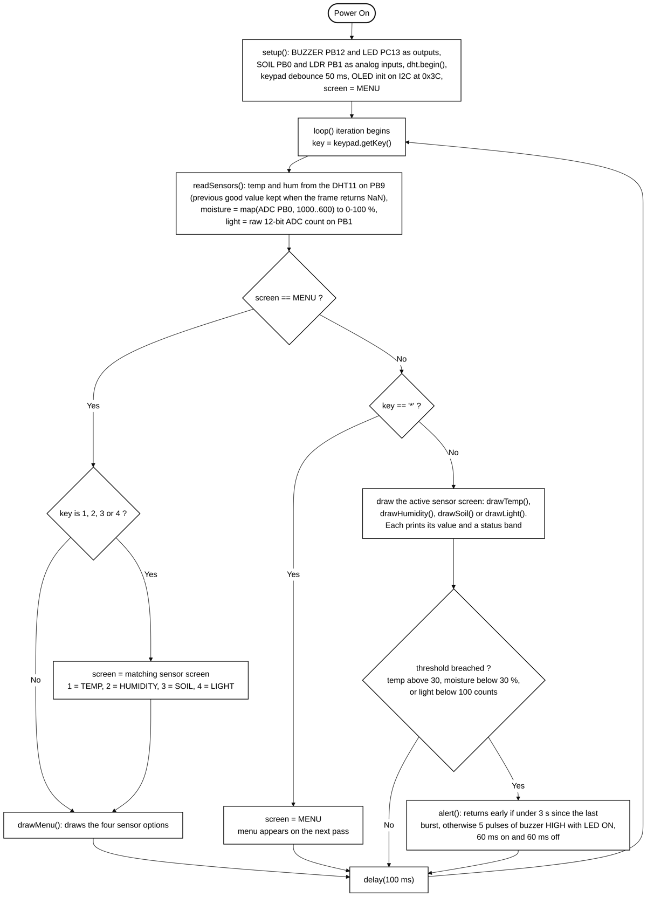

# 🌱 PLANT-X: Smart Plant Health Monitor

A standalone plant care monitor built on an **STM32F103C8T6 (Blue Pill)**. It reads soil moisture, air temperature, humidity and ambient light, shows each reading on a 0.96" OLED with a plain-language status (e.g. `DRY-Water me!`), and sounds a buzzer and LED when a value goes out of range.

No phone app, no Wi-Fi, no cloud. Plug it into any USB port and it works.

> Course project for **CSE 331L: Microprocessor Interfacing and Embedded Systems Lab**, North South University (Group 9).



## Features

- **Soil moisture**: YL-69 resistive probe on a 12-bit ADC channel, mapped to 0–100% using wet/dry endpoints measured on real soil. Alerts below 30%.
- **Temperature & humidity**: DHT11 on a single-wire bus. Corrupted frames (NaN) are discarded and the last good value is kept, so the display never blanks. Alerts above 30 °C.
- **Ambient light**: LDR in a voltage divider, shown as a raw ADC count (useful for calibration). Alerts below 100 counts.
- **Alerts**: buzzer + onboard LED pulse five times, rate-limited to one burst every 3 seconds. Can be muted from Settings.
- **Keypad UI**: 4×4 membrane keypad drives scrolling menus, one screen per sensor, and an all-sensor dashboard.
- **Auto return home**: after 1 minute without a keypress on any menu, the device goes back to the home screen.
- **Boot self-check**: checks the OLED, keypad, DHT11, soil probe and LDR on power-up and prints OK/FAIL for each.
- **Extras**: animated growing-plant home screen, system info page, an About screen, and five built-in OLED games: Snake, Tetris, Dino Run, Space Invaders and Breakout.

## Hardware

| Module | Purpose | Pins | Price (BDT) |
|---|---|---|---|
| STM32F103C8T6 Blue Pill | Main MCU | — | 450 |
| SSD1306 OLED 0.96" (I2C) | Display | PB6 (SCL), PB7 (SDA) | 260 |
| DHT11 | Temperature, humidity | PB9 | 120 |
| YL-69 soil moisture probe | Soil moisture (ADC) | PB0 | 70 |
| LDR 5 mm + 10 kΩ resistor | Ambient light (ADC) | PB1 | 7 |
| 4×4 membrane keypad | Navigation | Rows PA0–PA3, Cols PA4–PA7 | 80 |
| Active buzzer | Audible alert | PB12 | 17 |
| Onboard LED | Visual alert (active low) | PC13 | — |
| ST-LINK V2 mini | Flashing / debugging (SWD) | PA13, PA14 | 250 |
| Jumper wires | Interconnect | — | 55 |
| **Total** | | | **~1309** |



**Wiring notes**
- Everything runs from the Blue Pill's 3.3 V rail, which is also the ADC reference, so supply sag shifts reading and reference together.
- The LDR forms a divider with a 10 kΩ resistor to ground; the junction goes to PB1.
- The keypad ribbon plugs straight onto PA0–PA7, which is why the row order is reversed in software.

## Keypad controls

| Where | Key | Action |
|---|---|---|
| Home screen | `5` | Open main menu |
| Menus | `2` / `8` | Move up / down |
| Menus | `5` | Select |
| Anywhere | `*` | Go back |
| Settings | `5` | Toggle buzzer on/off |
| Games | `2` `4` `6` `8` | Up / left / right / down (`2` = jump in Dino, rotate in Tetris) |
| Games | `#` | Restart after game over |

## Build and flash

The firmware is C++ on the Arduino framework (STM32duino core), built with [PlatformIO](https://platformio.org/).

```bash
# build
pio run

# flash over ST-LINK (SWD)
pio run -t upload
```

Library dependencies are installed automatically from `platformio.ini`.

> **Tip:** the USB bootloader on many cloned Blue Pill boards does not enumerate. Flashing over SWD with an ST-LINK V2 avoids this and gives you a debugger too.

## How it works

`loop()` reads the keypad, reads all sensors, handles the key for whichever screen is active, and then draws that screen. Sensors are read before drawing, so every screen always shows fresh values without doing its own acquisition.



Full design details, test results and discussion are in the [project report](docs/PLANT-X_Report.docx).

## What didn't make it

- **HC-SR04 distance sensor**: two units returned no echo pulse on our wiring.
- **Servo-driven watering**: the servo only buzzed on every PWM pin tried, so automatic watering was dropped.

## Team

- Araf Tahsan Pavel
- Ismot Ara Emu
- Md Yeasin Arafat
- Md. Mashrur Reza

Course Faculty: Mr. Acramul Haque Kabir · Lab Instructor: Jannat Sultana
